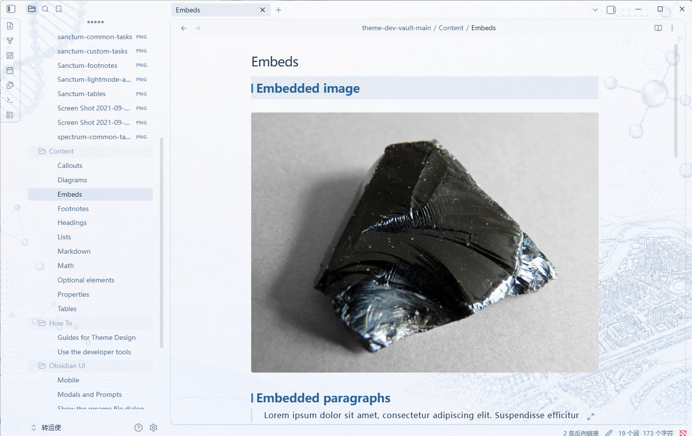
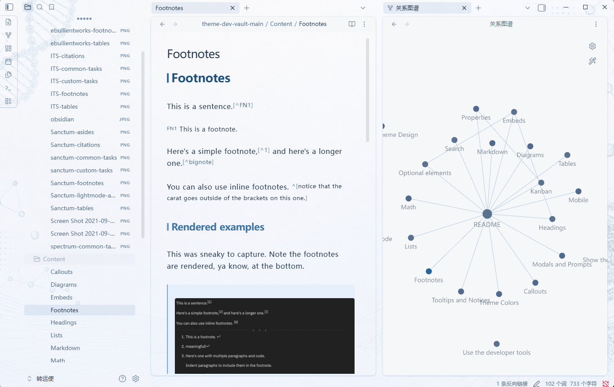
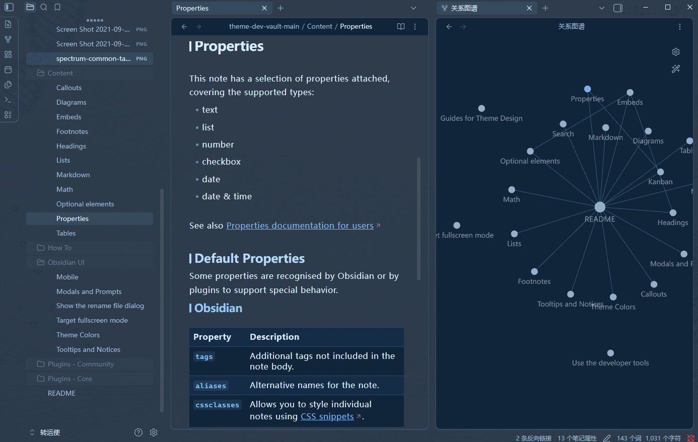

[English](README.md) | [中文](README.zh-CN.md)

# Campus Vitae

> A serene, campus-inspired theme for focused writing and academic work.

Campus Vitae brings a quiet academic atmosphere to Obsidian through a soft blue-and-white palette, subtle scientific motifs, and artwork inspired by a university campus. It supports both light and dark modes and offers extensive customization through the Style Settings plugin.

## Screenshots

### Light mode and graph view

### Dark mode

## Features

- Light and dark modes with a calm academic visual language
- Campus-inspired background artwork with subtle scientific motifs
- Adjustable typography, content width, paragraph spacing, and heading styles
- Multiple callout, table, outline, and navigation styles
- Optional rainbow folder tree and Components plugin integrations
- Dedicated styling for code, properties, graphs, embeds, and academic tables

## Requirements

- Obsidian 1.12.0 or later
- [Style Settings](https://github.com/mgmeyers/obsidian-style-settings) is optional but recommended for customization
- [Components](https://cp.cc1234.cc/) is optional and only required for the related component styles

The campus wallpaper is designed primarily for the desktop interface. The theme remains usable on mobile without the desktop background treatment.

## Installation

### Community Themes

Once Campus Vitae is available in the Obsidian Theme Gallery:

1. Open **Settings → Appearance**.
2. Select **Manage** next to Themes.
3. Search for **Campus Vitae** and select **Install and use**.

### Manual installation

1. Download `manifest.json` and `theme.css` from the [latest release](https://github.com/UHRS-AI-Association/obsidian-CampusVitae/releases/latest).
2. Create a folder named `Campus Vitae` inside your vault's `.obsidian/themes/` directory.
3. Place both files in that folder.
4. Open **Settings → Appearance** and select **Campus Vitae**.

## Customization

Install Style Settings, then open **Settings → Style Settings → Campus Vitae**. From there you can switch color schemes and adjust typography, layout, headings, tables, callouts, navigation, folder colors, and component styles.

## Credits

Campus Vitae is based on [Obsidian Composer](https://github.com/vran-dev/obsidian-composer) by [vran](https://github.com/vran-dev). Thank you to vran for making Composer available under the MIT License. See [CREDITS.md](CREDITS.md) for details.

## License

Campus Vitae is released under the [MIT License](LICENSE).
